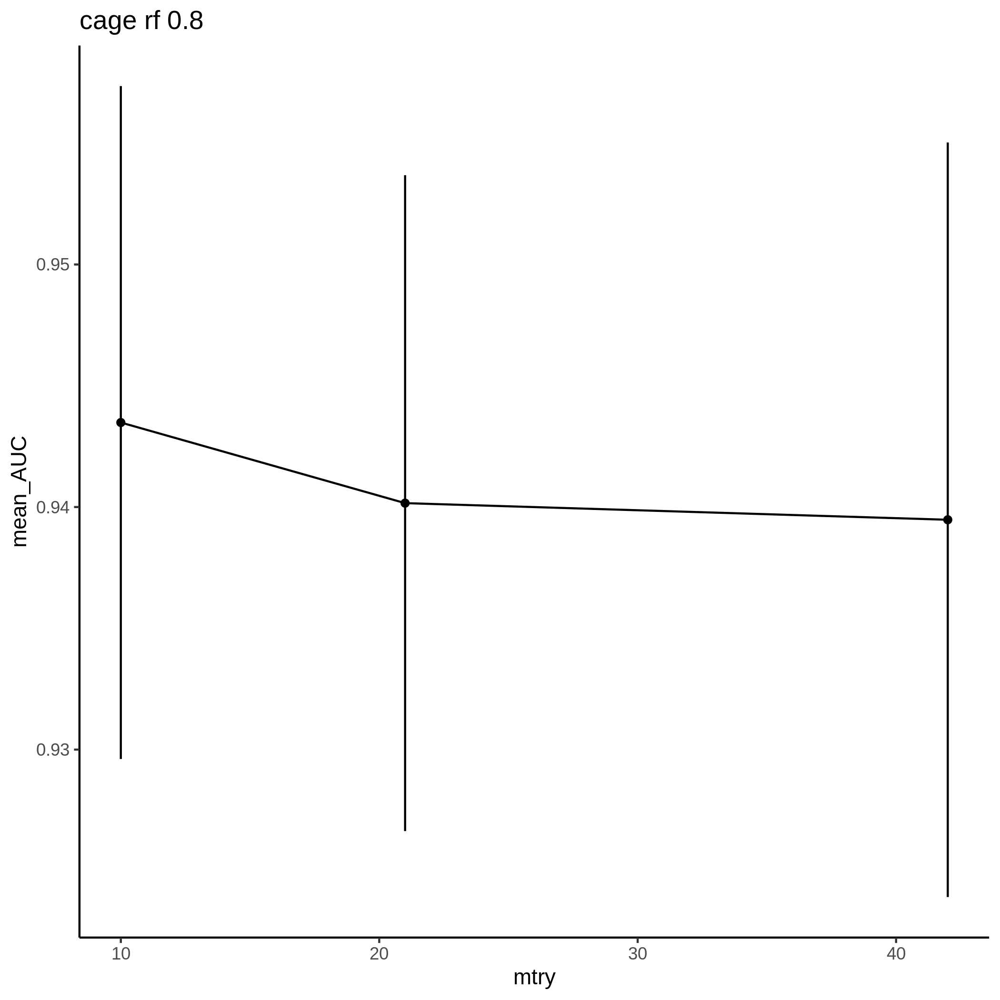
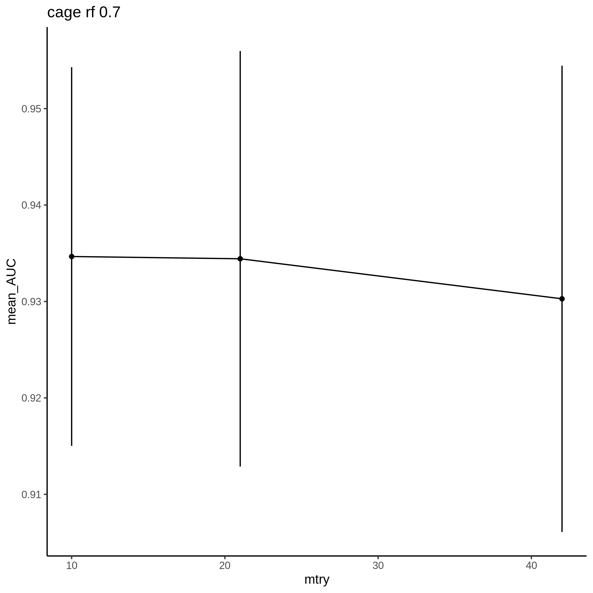
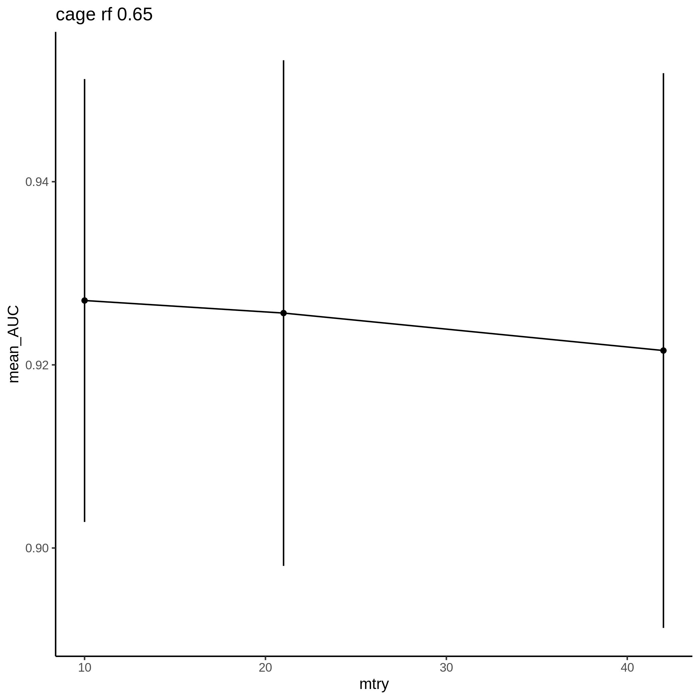
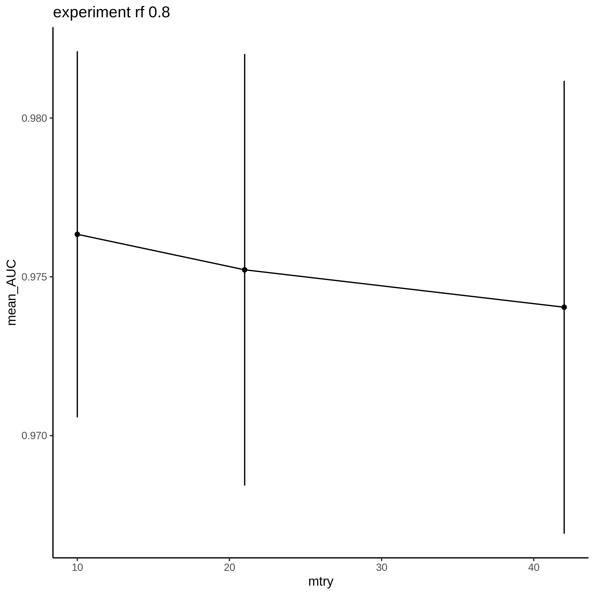
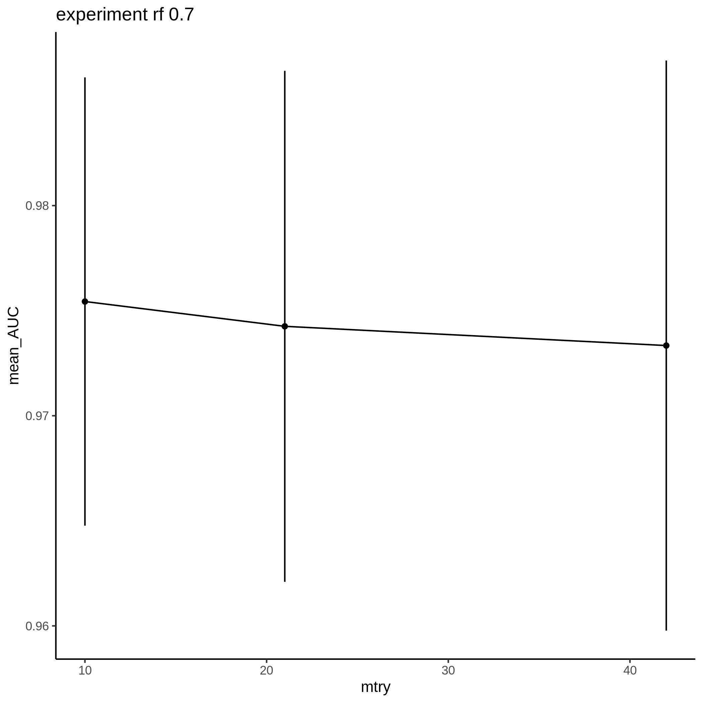

ML Results
================
2022-01-29

Machine learning algorithms used include: rf. Models were trained with
10 different random partitions of the data into training and testing
sets using 5-fold cross validation.

## Model Performance

## Hyperparameter Performance

## Memory Usage & Runtime

Each model training run was given 4 cores for parallelization.
